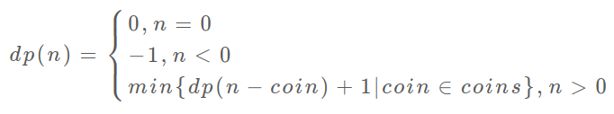

# 动态规划
## 动态规划三要素：重叠子问题、最优子结构、状态转移方程
重叠子问题：重复计算会导致直接暴力穷举的效率很低，可以使用自顶向下的递归算法加上备忘录来剪枝，
而动态规划中则是采用自底向上的dp数组加上循环遍历来解决

最优子结构：是否能通过子问题的最值得到原问题的最值

状态转移方程：即用子问题到母问题的转移数学表达式（最困难）

## 思考状态转移方程的方式
明确[状态] -> 明确[选择] -> 定义dp数组含义

## 代码框架（自底向上）
```
# 自顶向下递归的动态规划
def dp(状态1, 状态2, ...):
    for 选择 in 所有可能的选择:
        # 此时的状态已经因为做了选择而改变
        result = 求最值(result, dp(状态1, 状态2, ...))
    return result

# 自底向上迭代的动态规划
# 初始化 base case
dp[0][0][...] = base case
# 进行状态转移
for 状态1 in 状态1的所有取值：
    for 状态2 in 状态2的所有取值：
        for ...
            dp[状态1][状态2][...] = 求最值(选择1，选择2...)
```

以换硬币问题为例：力扣322题（零钱兑换）

1. 确定状态：原问题和子问题中会变化的变量。硬币数量无限，硬币面额给定，因此只有目标金额会一直变化
2. 确定选择：导致状态产生变化的行为。目标金额变化的原因是选择了硬币，每选择一枚硬币相当于减少了目标金额。
3. 明确dp数组的定义：dp[i]存放的是当目标金额为i时，最少需要多少枚硬币凑出

于是可以得到此题的状态转移方程



# 代码实现

```
class Solution:
    def coinChange(self, coins: List[int], amount: int) -> int:
        # 数组大小为 amount + 1，初始值也为 amount + 1
        dp = [amount + 1] * (amount + 1)
        dp[0] = 0
        # base case
        # 外层 for 循环在遍历所有状态的所有取值
        for i in range(len(dp)):
            # 内层 for 循环在求所有选择的最小值
            for coin in coins:
                # 子问题无解，跳过
                if i - coin < 0:
                    continue
                dp[i] = min(dp[i], 1 + dp[i - coin]) 
        return -1 if dp[amount] == amount + 1 else dp[amount]
```


